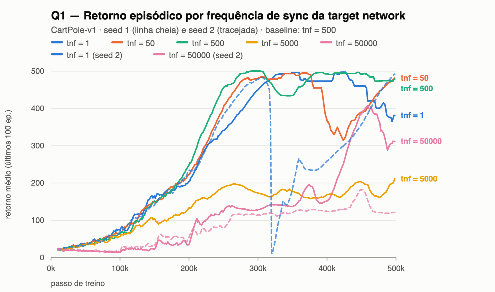
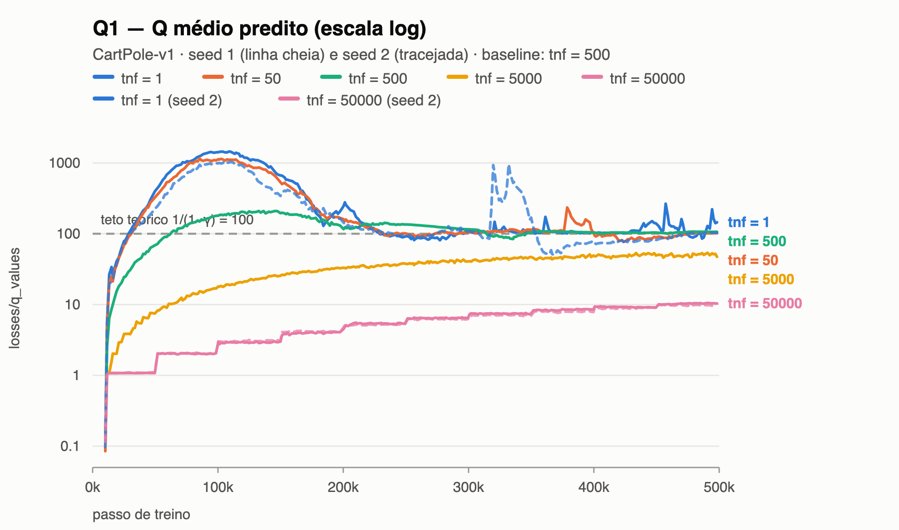
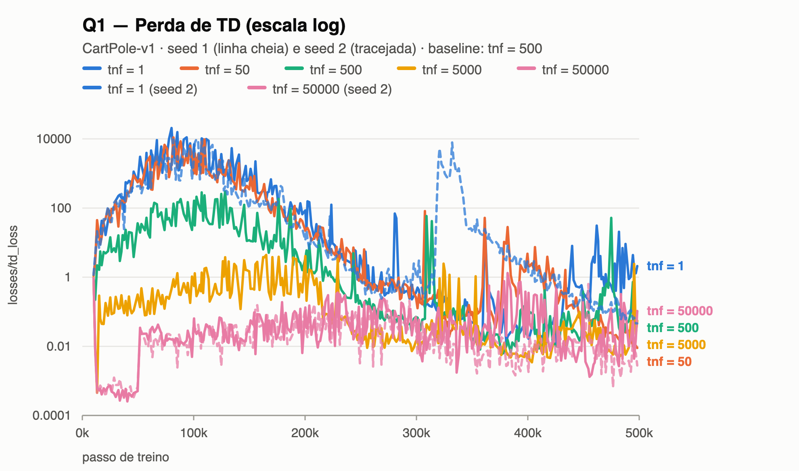
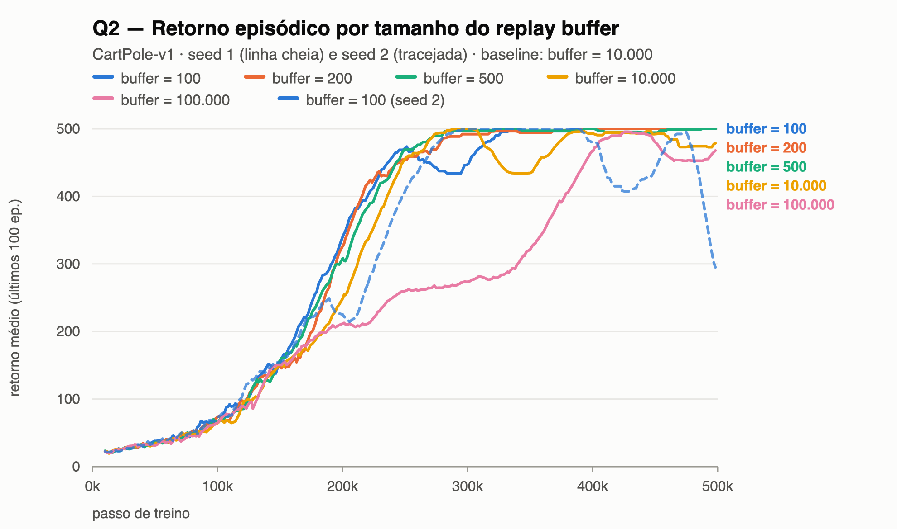
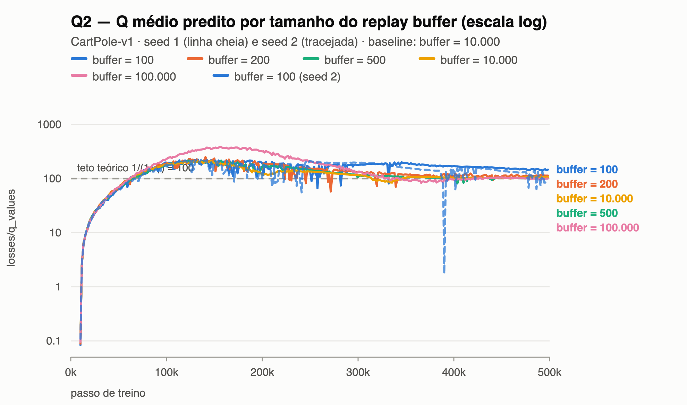
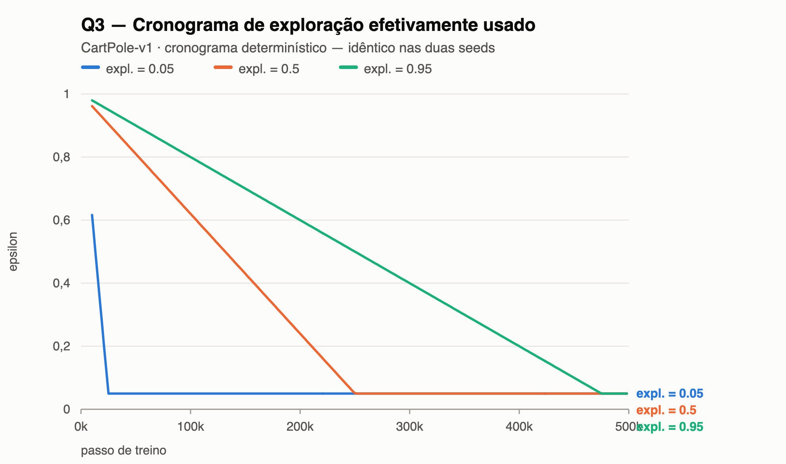
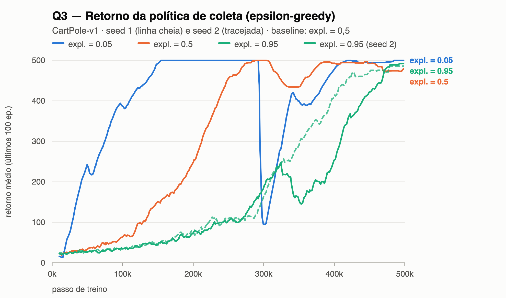

# Deep Q-Networks — Relatório experimental

**Autor(es):** Frederico Barbosa Relvas · **Fork com o `algorithms/dqn.py`
completo:** https://github.com/FredRelvas/t-zero-learning

CartPole-v1, 500.000 passos, baseline = `configs/dqn_cartpole.yml` sem alterações. Com recompensa
1 por passo e truncation **não** tratada como terminal, o valor de um estado sob política que
equilibra é 1/(1−γ) = **100** — referência usada em toda a análise. Previsões registradas antes
das varreduras em `previsoes.md`.

## Q1 — Frequência de sincronização da target network

**Previsão.** Com `tnf=1` o alvo é a própria rede treinada: elevar Q(s,a) eleva Q(s′), o alvo foge
enquanto é perseguido e o `max` acumula sobrestimações — prevejo retorno instável e `q_values`
acima de 100. Com `tnf=50000` o alvo fica estável mas desatualizado e cada sync propaga só um
passo de bootstrap, então prevejo `q_values` em degraus até a ordem de 10 e `td_loss`
enganosamente baixa.

**Varredura.** `dqn.target_network_frequency` ∈ {1, 50, **500**, 5000, 50000}, seed 2 em 1 e 50000.

  

**Explicação.** A target network desacopla o alvo dos pesos em atualização, tornando cada
intervalo entre syncs uma regressão aproximadamente estacionária. Sem ela (`tnf=1`), elevar Q(s,a)
eleva também max Q(s′,·) — os pesos são compartilhados — e o `max` acumula viés positivo em vez de
cancelá-lo: o `q_values` chega a **1.492**, quase 15× o teto de 100, com overshoot monotônico na
velocidade do alvo (10,5 → 55,7 → 217 → 1.158 → 1.492). Com `tnf=50000` o problema se inverte e
deixa de ser instabilidade: cada sync propaga um passo de bootstrap, e c(k) = (1 − γᵏ)/(1 − γ) com
9 syncs limita Q a ≈ 9,6 — mediu-se 10,4 e 9,7, em degraus visíveis. Os dois extremos confirmaram
a previsão. E é no extremo lento que o `td_loss` engana, porque mede a distância até o alvo e não
até o valor verdadeiro: ajustar um alvo congelado é regressão fácil, e a seed 2 termina com
`td_loss` = **0,0015**, o menor de toda a varredura, com o **pior** retorno (121,6 contra 442-478
do baseline) e avaliação greedy de 131.

## Q2 — Tamanho do replay buffer

**Previsão.** Espero que `buffer_size=500` falhe por correlação (cada minibatch é ~1/4 do buffer,
então gradientes sucessivos apontam na mesma direção) e por cobertura (500 transições guardam
pouco mais de um episódio da política atual, e a rede esquece estados que não visita mais).
Prevejo `q_values` oscilando e retorno que sobe e colapsa ciclicamente; com 100000, atraso na
subida inicial e final próximo do baseline.

**Varredura.** `dqn.buffer_size` ∈ {100, 200, 500, 2000, **10000**, 100000}, seed 2 em 100.

 

**Explicação.** A previsão **não se confirmou** em 500, que terminou em 500,0 de retorno, avaliação
greedy 500 e `q_values` de 100,9 — o mais próximo do teto em toda a varredura. A razão é em parte
aritmética: cada transição é amostrada, em média, `batch_size / train_frequency` = 12,8 vezes
durante sua vida no buffer, **independente do tamanho dele**, porque um buffer menor a guarda por
menos passos mas cada sorteio tem mais chance de escolhê-la. Buffer pequeno não significa reusar
mais os mesmos dados, e sim dados mais on-policy — suficiente num ambiente de distribuição
estreita como o CartPole. A quebra só aparece em 100, com os dois mecanismos visíveis:
**correlação**, porque `batch_size=128 > 100` faz de cada minibatch o buffer inteiro amostrado com
reposição e o `q_values` infla para 147,8, contra ~101 em 500 e 2.000; e **cobertura**, porque 100
transições guardam um quinto de um episódio já equilibrado, sem nenhuma transição perto da falha,
de modo que a rede esquece como valorar os estados de risco — a seed 2 sobe a 500, cai a 415,
recupera a 495 e desaba a 281,8, com avaliação greedy de 254. A forma oscilante prevista estava
certa; o limiar, não. No extremo oposto o efeito se inverte: 100.000 precisou de 377.600 passos
para chegar a 400, contra ~220.000 dos buffers pequenos.

## Q3 (extra) — Fração de exploração

**Previsão.** Escolhi reportar `charts/epsilon` (cronograma efetivo), o retorno episódico (que mede
a política **epsilon-greedy de coleta**) e `eval/mean_return` (que mede a **greedy**), porque
prevejo que os dois últimos discordem. Com `0.05` o epsilon cai a 0,05 em 25 mil passos: subida
rápida, com risco de convergência prematura. Com `0.95` só chega lá em 475 mil: retorno preso em
valores baixos, salto no fim, e ainda assim eval alto.

**Varredura.** `dqn.exploration_fraction` ∈ {0,05, **0,5**, 0,95}, seed 2 em 0,95.

 

**Explicação.** A previsão se confirmou: **`eval/mean_return` = 500 nas três configurações**,
apesar de curvas de treino radicalmente diferentes. Com `0.95` o gráfico de `epsilon` mostra o
cronograma valendo 0,5 na metade do treino; com metade das ações aleatórias o bastão cai cedo e o
retorno fica em 103,1 em 250k passos, contra 453,9 do baseline, disparando só no fim, quando o
epsilon desce. Isso não é a política aprendida sendo ruim, é a de coleta sendo ruidosa — e a
avaliação greedy prova a diferença. Sem o gráfico de `epsilon` ao lado, a curva seria lida como
"aprendeu mal" e a conclusão se inverteria, e é por isso que ele era indispensável aqui. No outro
extremo, o risco previsto apareceu como fragilidade e não como estagnação: com `0.05` o retorno
chega a 500 em 150 mil passos, o mais rápido da varredura, mas **colapsa para 95,2** em torno de
300k antes de recuperar, porque com o epsilon mínimo desde 25 mil passos resta pouca exploração
para gerar os dados que corrigiriam uma atualização ruim.

**Reprodução.** `python train.py --config dqn_cartpole --override <chave>=<valor> seed=<n> capture_video=false`
