# Policy Gradient com Actor-Critic (A2C) — Relatório experimental

**Autores:** Frederico Barbosa Relvas · Henrick de Souza Silva · **Fork com
`algorithms/a2c.py` e `networks/discrete_actor_critic.py` completos:**
https://github.com/FredRelvas/t-zero-learning

CartPole-v1, 500.000 passos, baseline = `configs/a2c_cartpole.yml` sem alterações. O lote é
`num_envs` × `num_steps` = 8 × 5 = **40**, o que dá 12.500 atualizações; o baseline chega a
retorno 475/486 (seeds 1/2) e avaliação 500 ± 0. As Q1 e Q2 alteram o lote e portanto também
**quantas atualizações cabem** no orçamento fixo de passos. Previsões registradas antes das
varreduras em `previsoes_a2c.md`.

## Q1 — Número de atores em paralelo

**Previsão.** Com 1 ambiente o lote cai para 5 transições consecutivas do mesmo episódio, então
prevejo `policy_loss` com oscilação várias vezes maior, e que isso não seja compensado pelas
100.000 atualizações que o lote pequeno permite. Prevejo `SPS` saturando depois de 8, pelos 10
núcleos da máquina.

**Varredura.** `num_envs` ∈ {1, **8**, 32}, 2 seeds em cada.

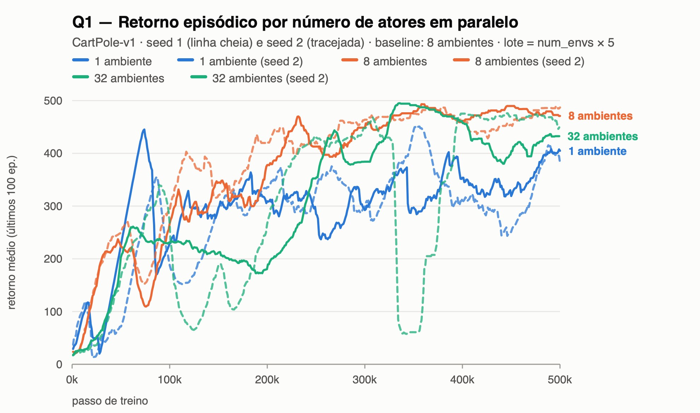 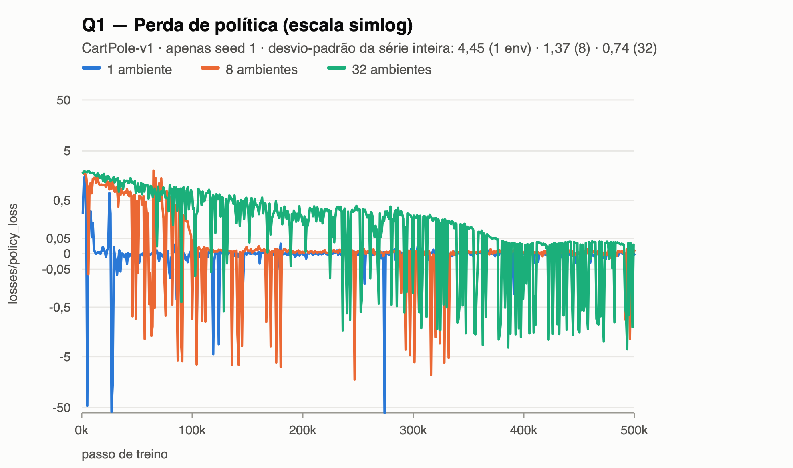 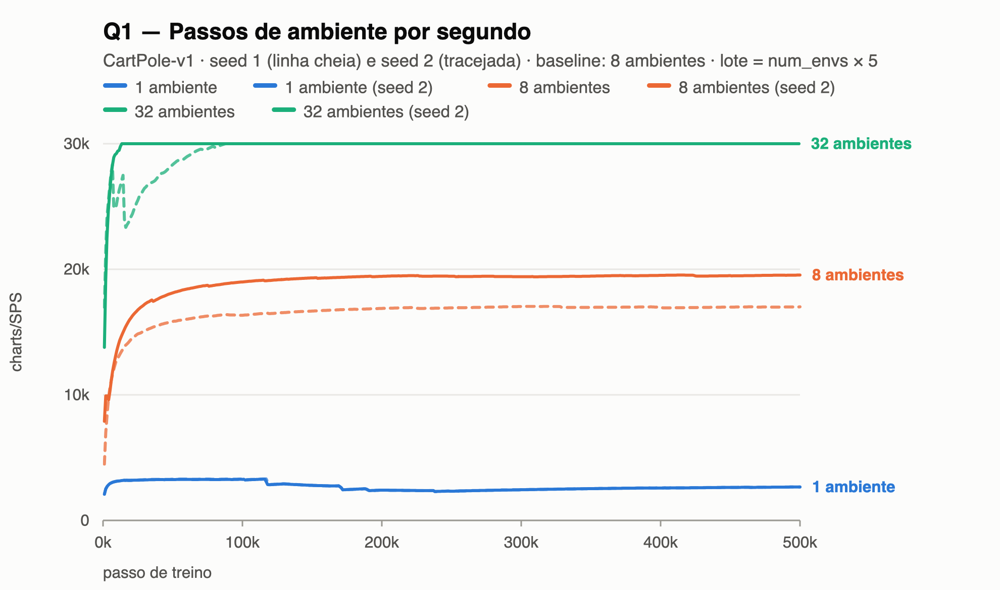

**Explicação.** Os três gráficos separam as configurações de forma limpa. No `policy_loss`, o
traço de 1 ambiente fica colado em zero quase o tempo todo e dá picos isolados de ±50, enquanto o
de 32 oscila numa faixa estreita — o desvio-padrão da série cai **4,45 → 1,37 → 0,74** de 1 para 8
e 32 ambientes. No retorno, o baseline está no topo e 1 ambiente embaixo, com as duas seeds bem
afastadas. E o `SPS` sobe de 2.655 para 19.531 e 33.085, sem achatar. O mecanismo por trás: um
método on-policy não pode usar replay buffer, então a descorrelação que o DQN obtinha no tempo tem
de vir do espaço — vários ambientes em fases diferentes de episódios diferentes, que é o argumento
central do A3C. Com lote de 5 as transições vêm do mesmo trecho de episódio e têm vantagem quase
idêntica, daí o formato intermitente, o mais nocivo possível para o gradiente. Separando os dois
efeitos, 1 ambiente faz **8× mais** atualizações que o baseline e ainda assim aprende pior (`eval`
411 e 256 contra 500/500): a degradação é da *qualidade* de cada passo, não da quantidade. Já 32
ambientes têm o gradiente mais limpo mas só 3.125 atualizações, e terminam abaixo do baseline
(`eval` 500 e 360) — subtreino, como previsto. **A previsão do `SPS` foi refutada:** não houve
saturação nos 10 núcleos, porque o gargalo do CartPole não é a física e sim o custo fixo por passo
em Python/torch, que uma passada forward em lote amortiza.

## Q2 — Horizonte do retorno de n passos

**Previsão.** Com `num_steps=1` o alvo é quase todo bootstrap — pouca variância, muito viés —,
então prevejo `value_loss` mínimo e `explained_variance` enganosamente alta, porque o alvo vira
quase função determinística de V(s′) e a métrica mede consistência de um passo, não acerto do
valor verdadeiro. Com n = 128 prevejo o contrário, mais subtreino pelas 488 atualizações.

**Varredura.** `a2c.num_steps` ∈ {1, **5**, 32, 128}, 2 seeds em 1, 5 e 128.

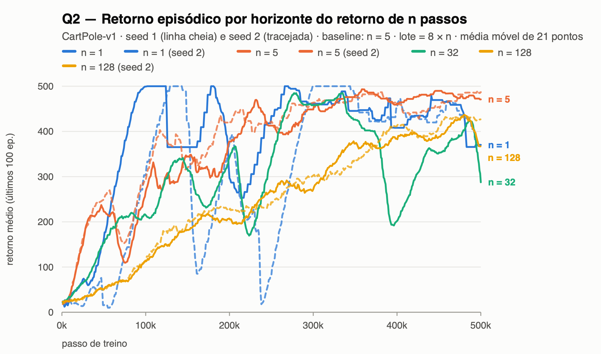 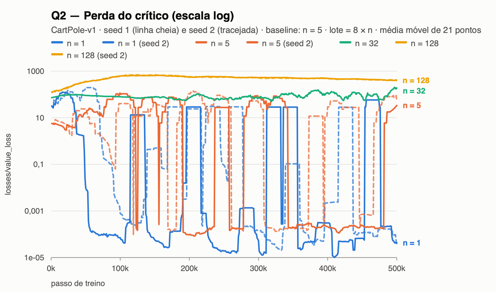 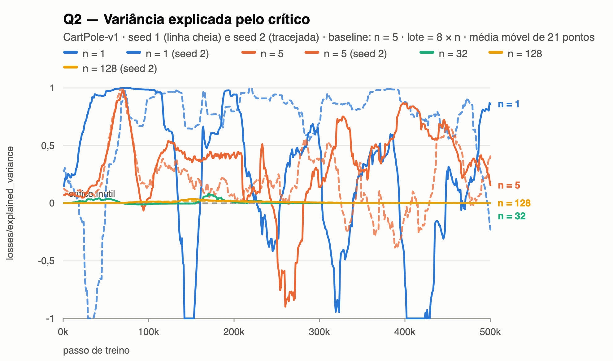

**Explicação.** O `value_loss` ordena as quatro configurações em patamares bem separados, na
ordem do horizonte: **≈10⁻⁵ → 18 → 160 → 410** para n = 1, 5, 32 e 128. A `explained_variance`
inverte essa ordem — n = 1 é a melhor da varredura (0,81) enquanto n = 32 e 128 ficam coladas em
zero. E o retorno não segue nenhuma das duas: o baseline vence, com ambos os extremos abaixo. A
leitura conjunta explica o aparente paradoxo. Com n = 1 o alvo r + γV(s′) é quase o próprio V(s),
já que estados adjacentes no CartPole têm valor quase igual: a regressão é trivial e as duas
métricas do crítico parecem ótimas. **Isso não significa crítico bom** — o `advantage_std` vale
**0,01**, ou seja, o peso do gradiente de política é essencialmente zero. O crítico está
consistente consigo mesmo sem informar nada sobre o valor verdadeiro. Na outra ponta ele não
consegue acompanhar: com n = 128 e 488 atualizações o `advantage_mean` sobe para **+21,6**, sinal
de que o retorno excede sistematicamente um V(s) que nunca teve passos para convergir. O ator
sofre junto porque a vantagem R − V(s) *é* o peso do gradiente, e os extremos caem para `eval` 186
(n = 32) e 323 (n = 128) contra 500 do baseline. **A previsão se confirmou parcialmente:**
esperávamos o baseline vencendo os dois extremos, mas n = 1 empatou na avaliação (500/500) e
perdeu só no retorno de treino (372/402 contra 475/486) — num ambiente de duas ações o sinal
minúsculo ainda tinha o sinal algébrico certo, e as 62.500 atualizações bastaram.

## Q3 — Coeficiente de entropia

**Previsão.** Sendo o bônus de entropia o único freio contra o colapso prematuro para uma política
determinística, prevejo que com `ent_coef=0` a entropia caia rápido mas o CartPole ainda seja
resolvido, com dispersão maior entre seeds. Com 0,1 prevejo entropia presa perto de ln 2 ≈ 0,69 e
retorno estacionado.

**Varredura.** `a2c.ent_coef` ∈ {0, **0,01**, 0,1}, 2 seeds em cada.

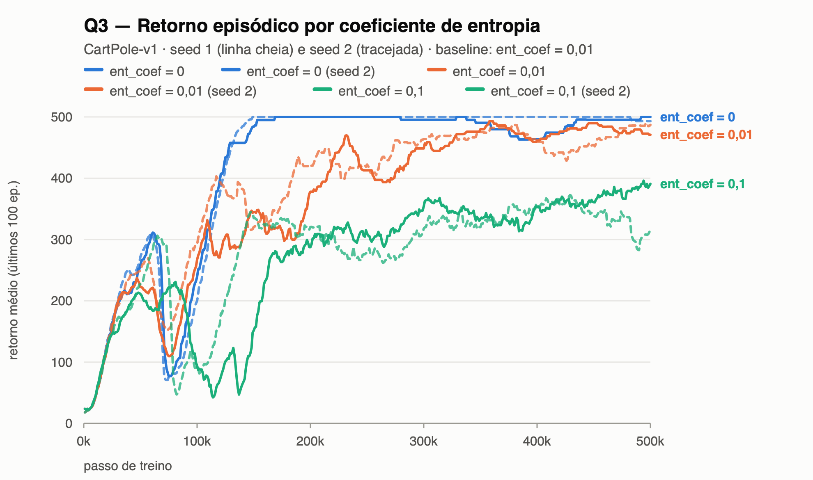 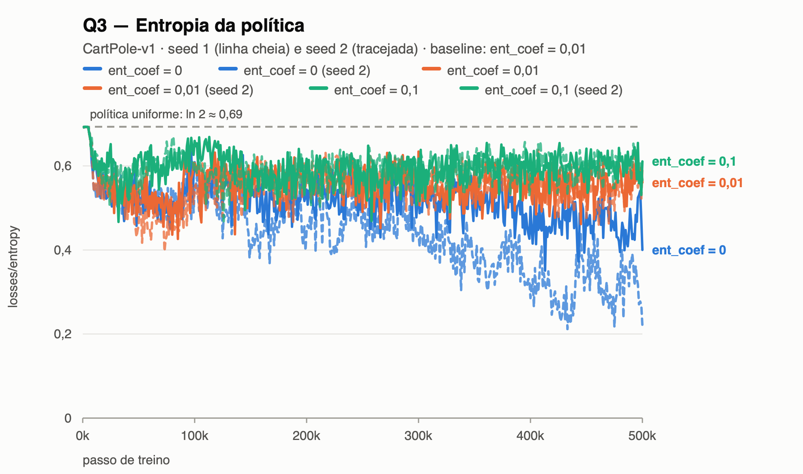

**Explicação.** O gráfico de entropia separa as três configurações em faixas que nunca se
cruzam: `ent_coef=0,1` colado no teto de ln 2 ≈ 0,69, o baseline em 0,56 e `ent_coef=0` descendo
até 0,46 e 0,33. O gráfico de retorno inverte a ordem — 0,1 é o pior (386/305) e `ent_coef=0` o
melhor (498/494, **acima** do baseline, que paga o imposto da entropia), com as duas seeds
resolvendo o ambiente (`eval` 500/500). O bônus existe para impedir o colapso prematuro, risco
específico do gradiente de política: uma ação ligeiramente mais provável é amostrada mais,
reforçada mais, e trava antes de as alternativas terem sido testadas. Que o CartPole sobreviva sem
ele se deve a três fatores somados: duas ações apenas, de modo que mesmo uma política quase
determinística explora metade do espaço por acidente; recompensa densa e positiva em todo passo,
de modo que o gradiente nunca fica sem sinal; e uma política boa simples o bastante para ser
achada antes de a entropia acabar. Com mais ações ou recompensa rara isso inverteria: o colapso
viria antes de qualquer trajetória recompensada ser amostrada e o agente travaria numa região sem
sinal. Com `ent_coef=0,1` a previsão se confirmou integralmente — o crítico melhora, as vantagens
encolhem, e o termo de entropia, que é constante, passa a dominar o gradiente. O agente está sendo
pago para permanecer indeciso.

## Q4 — Ablação do baseline

**Previsão.** Prevejo `advantage_mean` em torno de zero com baseline e fortemente positivo sem ele
(o retorno de 5 passos vale ≈ 4,9 + 0,95·V(s)), com `advantage_std` muito maior. Como todo peso
fica positivo, **toda** ação amostrada é reforçada, o que deve gerar realimentação de "rico fica
mais rico" e colapso de entropia. Prevejo ainda que `max_grad_norm=0,5` clipe quase todo passo.

**Varredura.** `a2c.use_baseline` ∈ {**true**, false}, 2 seeds em cada.

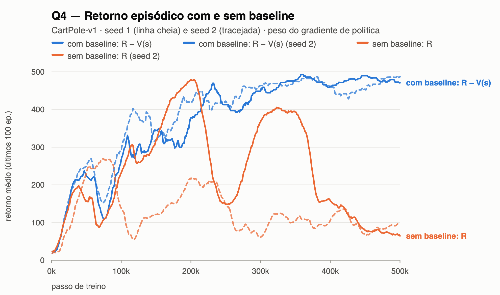 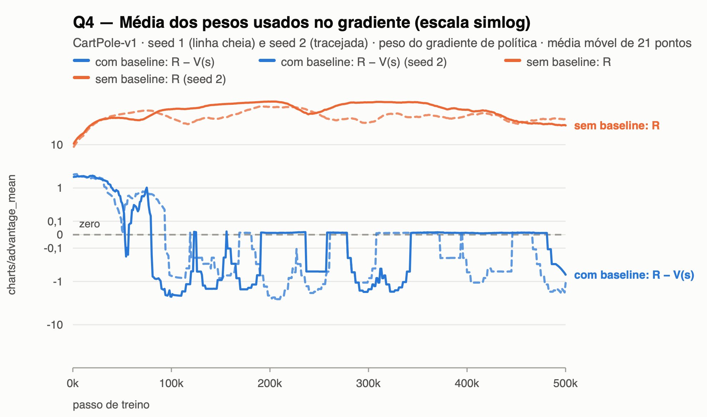 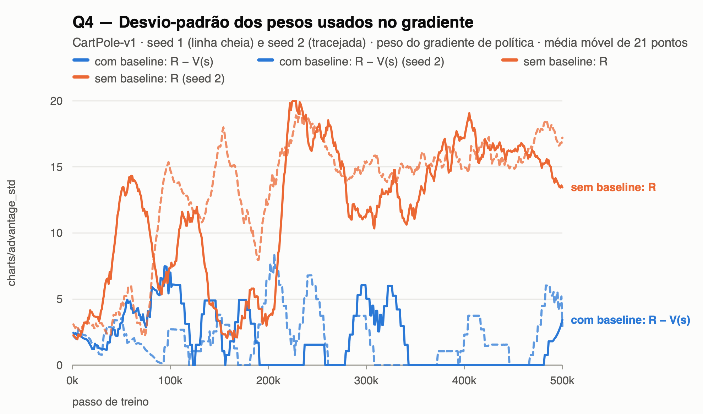 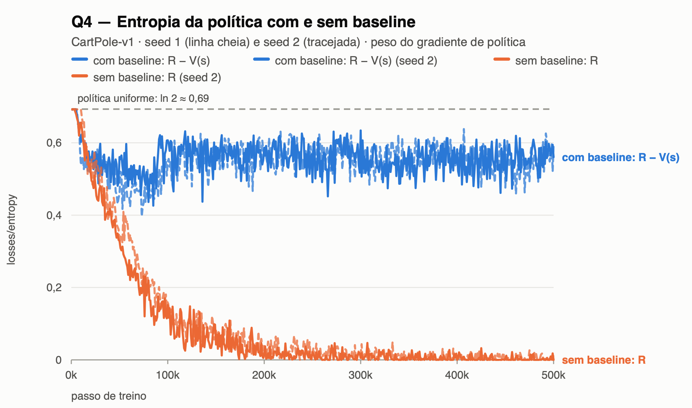

**Explicação.** Os quatro gráficos contam a mesma história em quatro tempos. O
`advantage_mean` oscila em torno de zero com baseline (−0,37 e −1,72) e sobe para um patamar de
**+27,7 e +38,3** sem ele; o `advantage_std` acompanha, de 1,9 para **14,1**; a entropia despenca
de 0,56 para **0,002**, política praticamente determinística; e o retorno cai de 475 para **69**.
A teoria prevê exatamente o primeiro par: subtrair um baseline que dependa só do estado não altera
o gradiente esperado, porque E[∇log π(a|s)·b(s)] = b(s)·∇Σπ(a|s) = b(s)·∇1 = 0 — altera apenas a
variância. Mas a consequência é de atribuição de crédito, não só de ruído: no CartPole toda
recompensa é +1, logo todo retorno é positivo, e um retorno de 80 tanto pode ser ótimo (estado
valia 40) quanto péssimo (estado valia 95) — sem subtrair V(s) os dois empurram a
log-probabilidade para cima com a mesma força. Como as ações são amostradas na proporção da
probabilidade atual, a que está na frente é reforçada mais vezes e a realimentação se fecha, o que
explica o colapso de entropia do terceiro gráfico. O clipping agravou o quadro: pesos de ordem 30
contra ~1 do baseline mantêm o gradiente saturado em `max_grad_norm=0,5` quase o tempo todo. Vale
registrar o achado mais instrutivo da varredura: sem baseline a `explained_variance` marca
**1,00** e o `value_loss` cai para 0,34 — os dois gráficos do crítico parecem perfeitos enquanto o
agente tira 69 de 500, porque a política colapsada produz episódios curtos e quase idênticos e
prever um retorno constante é trivial. É a lição da atividade anterior por um mecanismo novo:
**nenhuma métrica de perda deve ser lida isoladamente.**
